# Proyecto Análisis de Algoritmos
Proyecto de análisis de algoritmos 2025-3, Jan Marco Muñoz

# Diagramas Mermaid
# Procesamiento Distribuido de Imagenes en Redes P2P Moviles con Modelo de Recompensas
# Pontificia Universidad Javeriana — Mayo 2026

> **Nota sobre protocolo de comunicacion entre nodos:** El uso de gRPC sobre HTTP/2 como
> protocolo de comunicacion entre dispositivos esta planteado como opcion tecnologica pero es
> **sujeto a cambio** durante la fase de desarrollo. En los diagramas se referencia como
> *Canal P2P Local* y se anota con ⚠ donde corresponde.

---

## 1. Diagramas de Secuencia

---

### DS-01 · Registro de Usuario (CU-01)

```mermaid
sequenceDiagram
    actor U as Usuario
    participant APP as App Android
    participant API as Backend REST
    participant DB as Base de Datos Central

    U->>APP: Ingresa nombre, correo, contrasena y rol
    APP->>APP: Valida formato de los campos localmente
    alt Datos invalidos
        APP-->>U: Muestra errores de validacion en pantalla
    else Datos validos
        APP->>API: POST /auth/registro (nombre, correo, hash_password, rol)
        activate API
        API->>DB: INSERT INTO Usuario
        alt Correo ya registrado
            DB-->>API: Error de unicidad (duplicate key)
            API-->>APP: 409 Conflict
            deactivate API
            APP-->>U: El correo ya esta registrado
        else Registro exitoso
            DB-->>API: Usuario creado con UUID asignado
            API-->>APP: 201 Created - token JWT y perfil de usuario
            deactivate API
            APP->>APP: Almacena token JWT en memoria segura
            alt Rol = CONSUMIDOR
                APP-->>U: Redirige a Dashboard Consumidor
            else Rol = PROVEEDOR
                APP-->>U: Redirige a Dashboard Proveedor
            end
        end
    end
```

---

### DS-02 · Inicio de Sesion (CU-02)

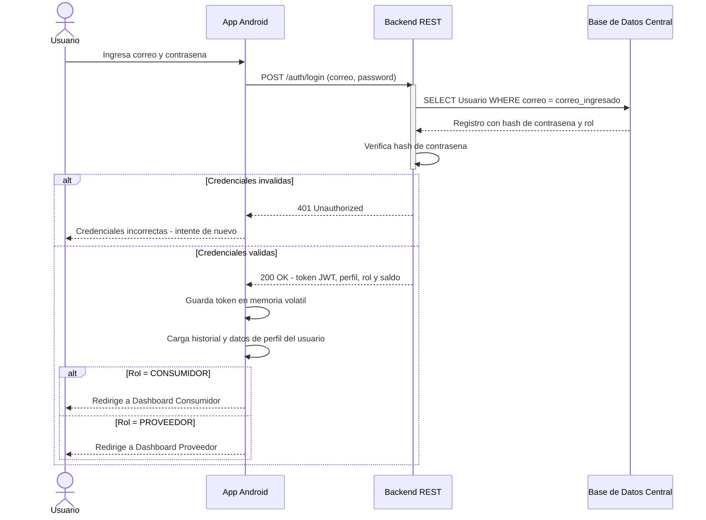

---

### DS-03 · Publicacion de Nodo Proveedor (CU-03)

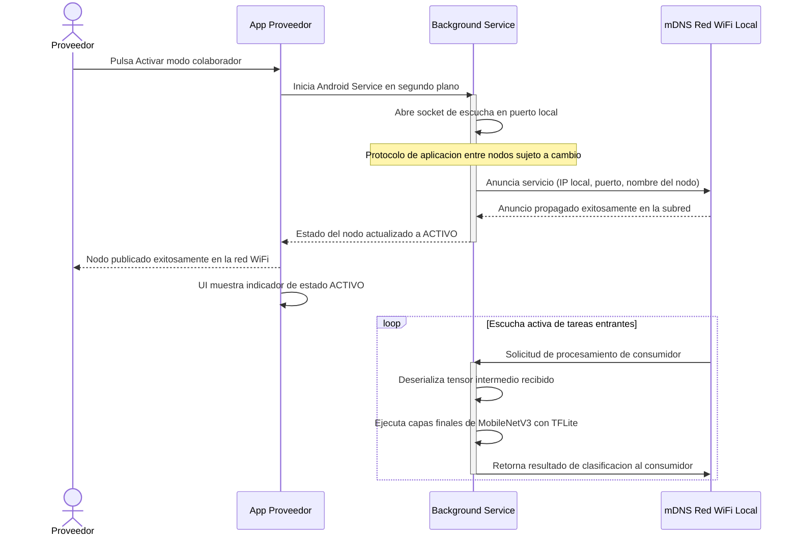

---

### DS-04 · Descubrimiento y Conexion a Nodo Proveedor (CU-04)

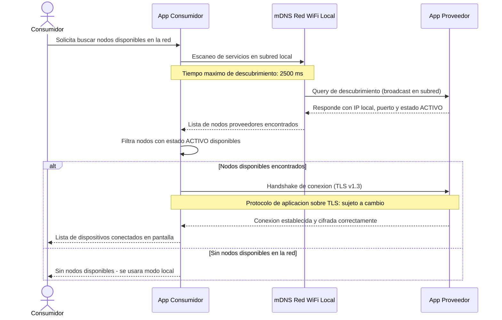

---

### DS-05 · Inferencia Distribuida - Flujo Principal (CU-05, CU-06, CU-07)

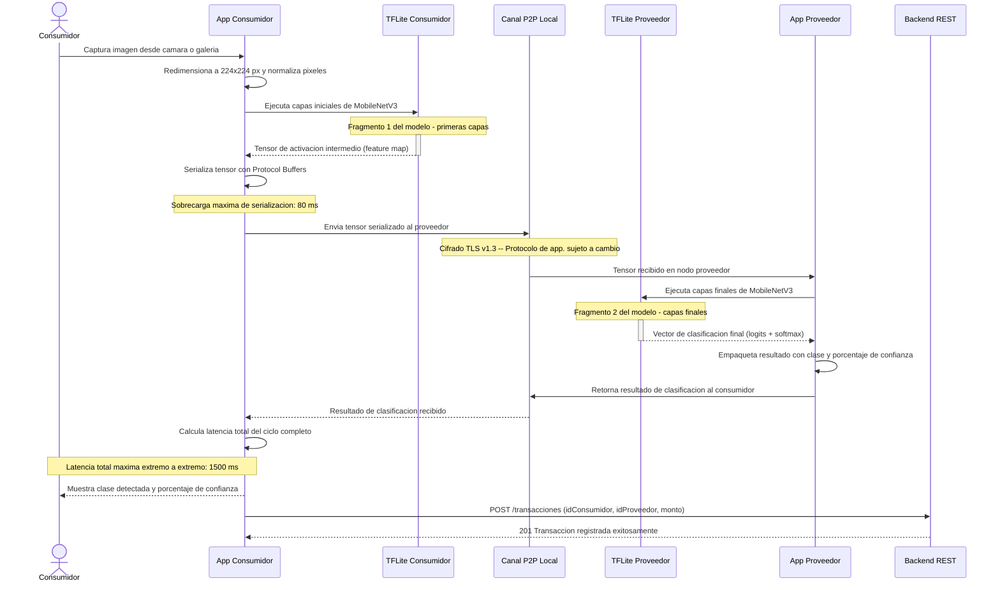

---

### DS-06 · Inferencia en Modo Fallback Local (CU-06 - Escenario alternativo)

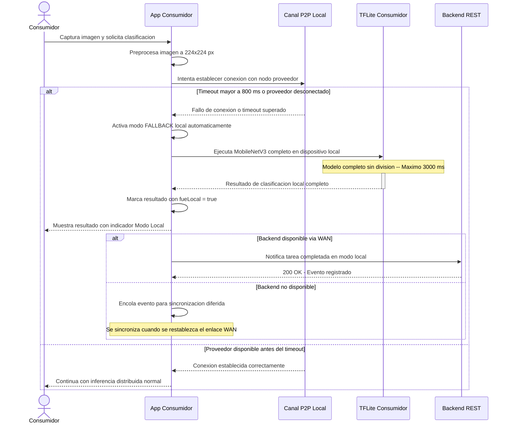

---

### DS-07 · Registro y Consulta de Recompensas (CU-08, CU-10)

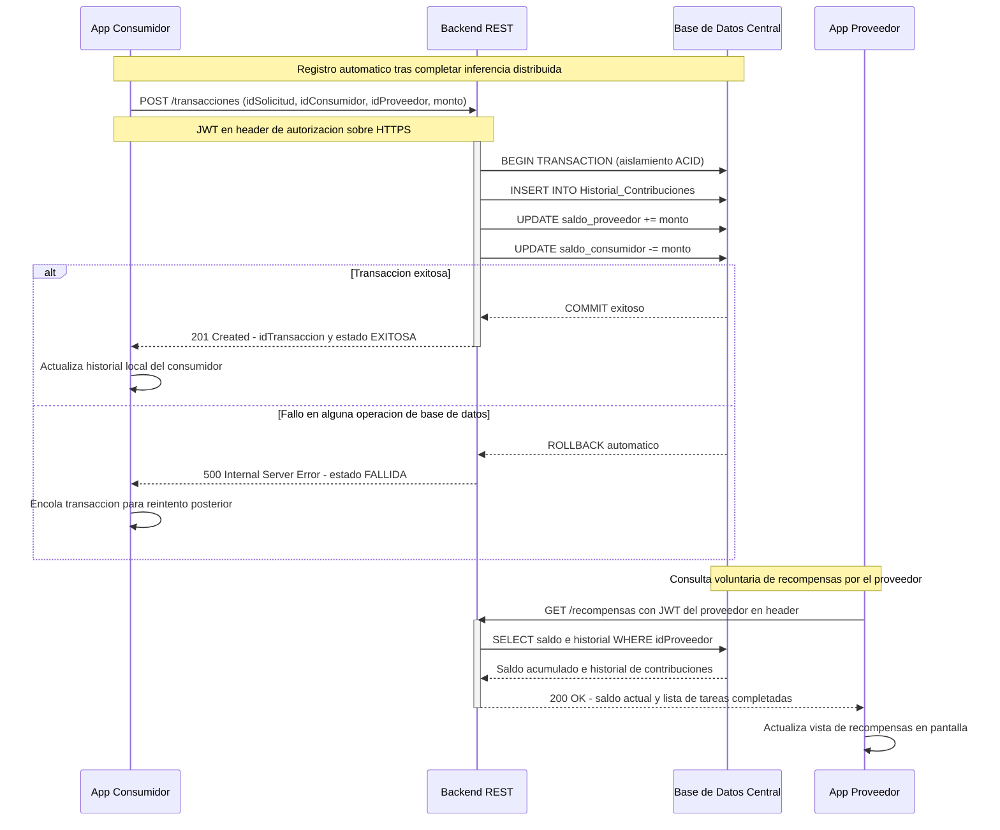

---

### DS-08 · Cierre de Sesion (CU-11)

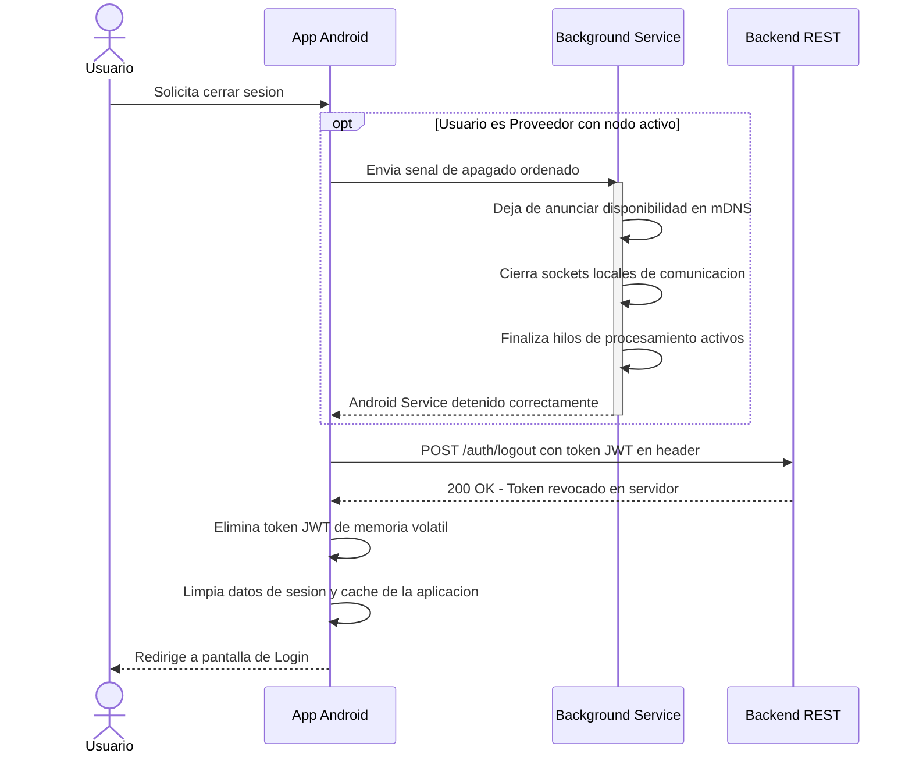

---

## 2. Diagrama de Arquitectura de Componentes

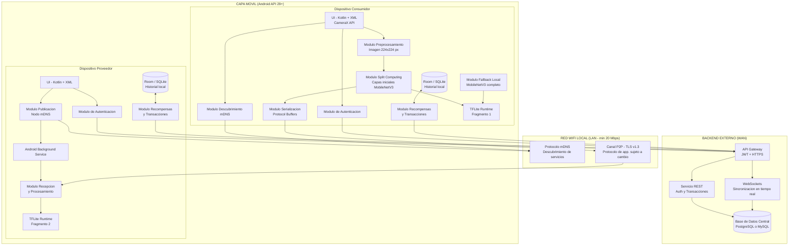

---

## 3. Diagrama de Navegacion

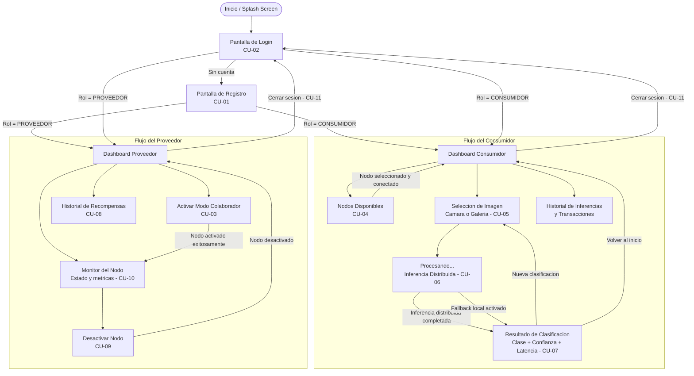

---

## 4. Diagrama de Dominio

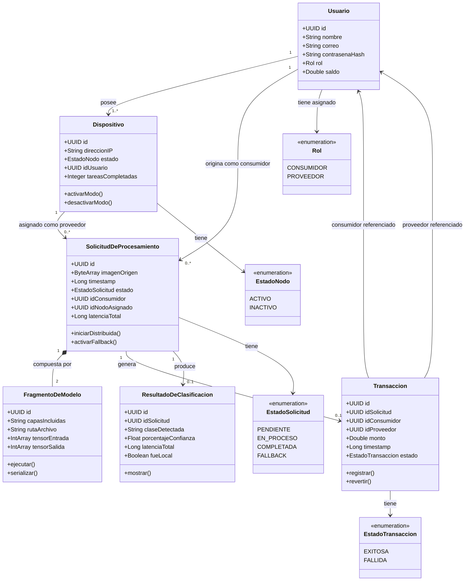

---

## 5. Diagrama de Despliegue

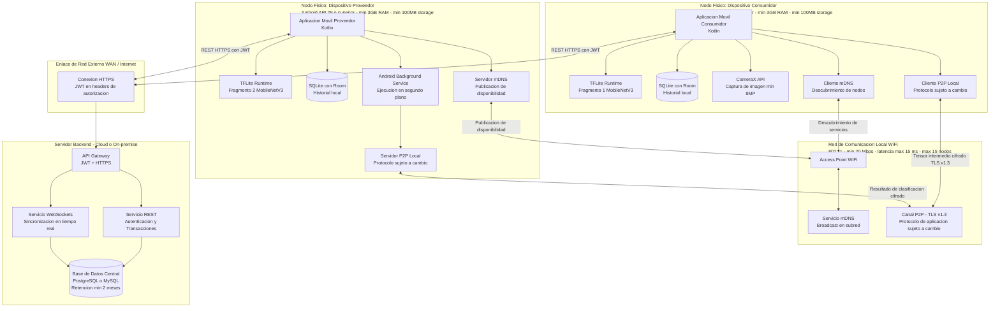

---

> **Leyenda de relaciones en diagrama de dominio:**
> - `*--` Composicion: el ciclo de vida del objeto hijo depende del padre
> - `-->` Asociacion: referencia entre entidades independientes
>
> **Leyenda de tecnologias usadas:**
> - **TFLite:** TensorFlow Lite para ejecucion del modelo MobileNetV3
> - **mDNS:** Multicast DNS (RFC 6762) para descubrimiento de servicios en LAN
> - **Protocol Buffers (proto3):** Serializacion de tensores intermedios
> - **JWT + HTTPS:** Autenticacion segura contra el backend externo
> - **TLS v1.3:** Cifrado de extremo a extremo en canal P2P local
> - **Room/SQLite:** Persistencia local en cada dispositivo Android
> - **CameraX:** API de Android Jetpack para captura de imagen
